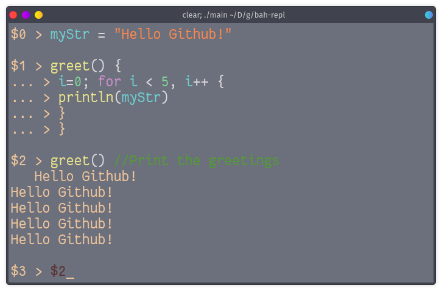

# Bah repl

<center>

<p>
A simple realtime REPL for Bah-lang with syntax highlighting.
</p>
</center>

> Bah Repl is only available for linux at the moment.

## Installation / compilation
To get started, clone this repository. Then:

1. Compile the repl:
```bash
bah main.bah -d
```

2. Execute the repl:
```bash
./main
```

## Commands
- `.include file.bah` (`.i`) to include a library (import is not supported),
- `.quit` (`.q`) to quit,
- `$nb` to redo the nb<sup>th</sup> line.